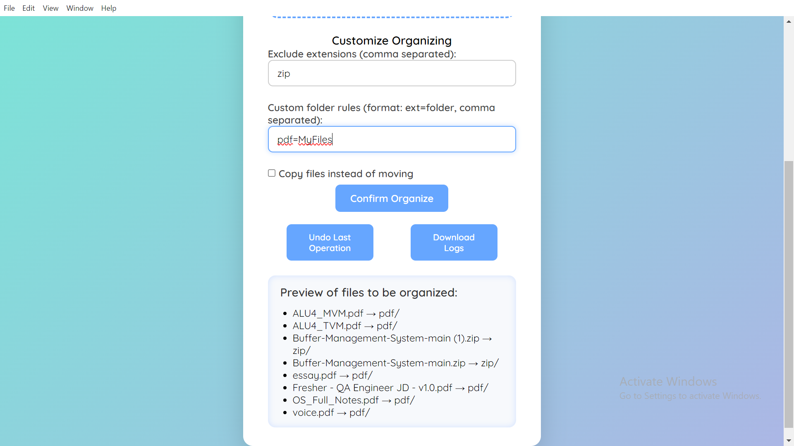
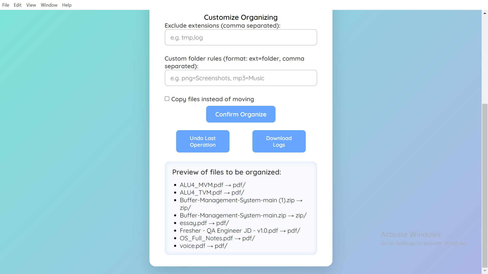
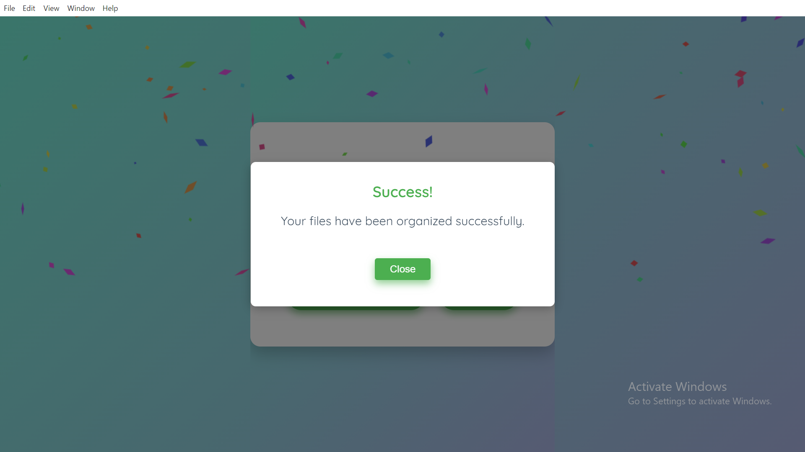
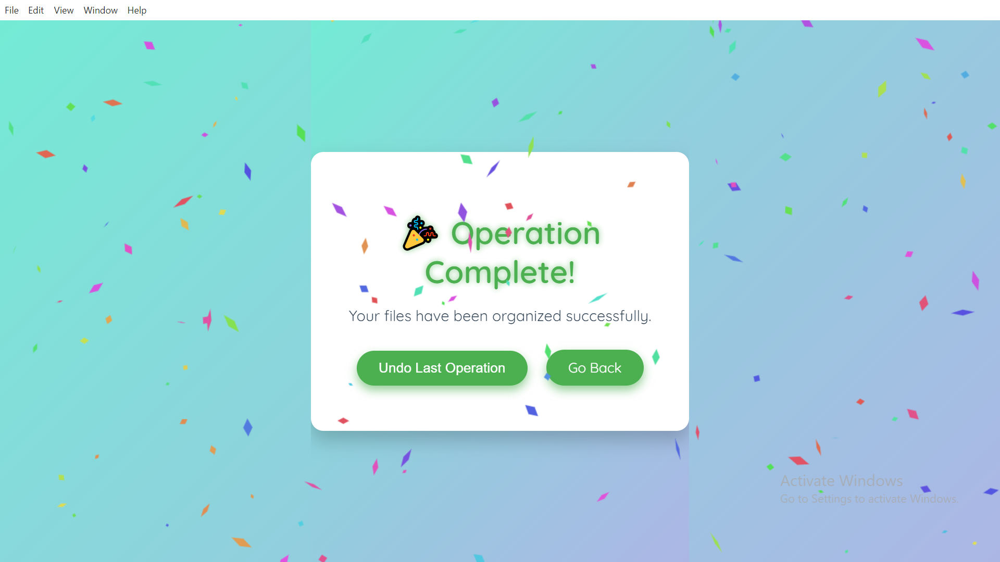
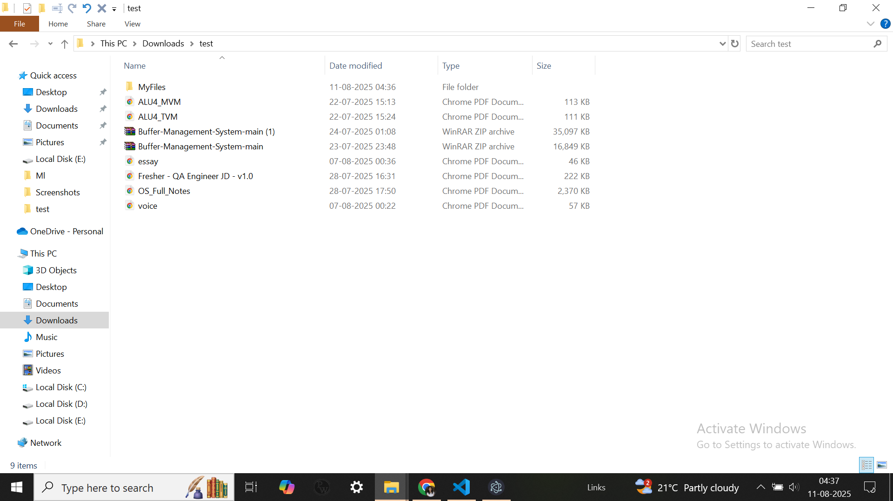

# Clutter Updated

This is a file organization application built with Electron.js, Node.js, and Express.js.

## Walk through:-

### Main User Interface

### Customization Options

### Drag and Drop

### Preview

### Success Alert

### Undo Functionality

### Undone Operation

