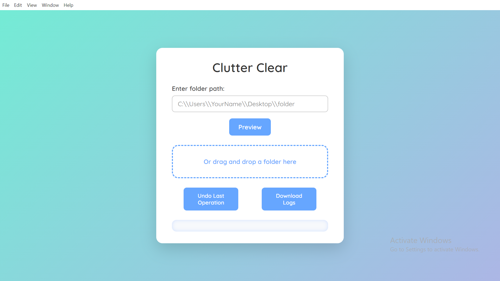
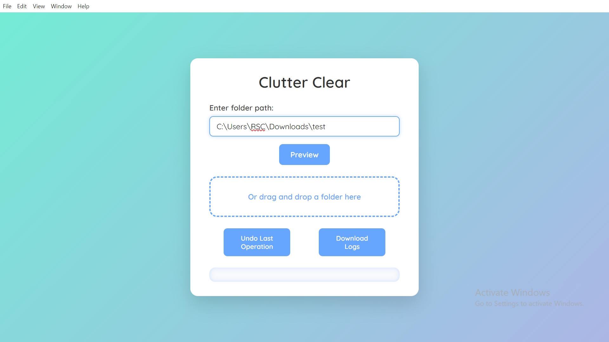

# Clutter Updated

This is a file organization application built with Electron.js, Node.js, and Express.js.

## Walk through:-

### Main User Interface

### These are the files which are to be organized .You can copy and paste the path of the folder 

### Lets paste in the path

### And do some customization

### And look at the preview 

### To see the app running successfully

### Organized folder 

### Undone Operation

###Downloaded logs:-
.png)

